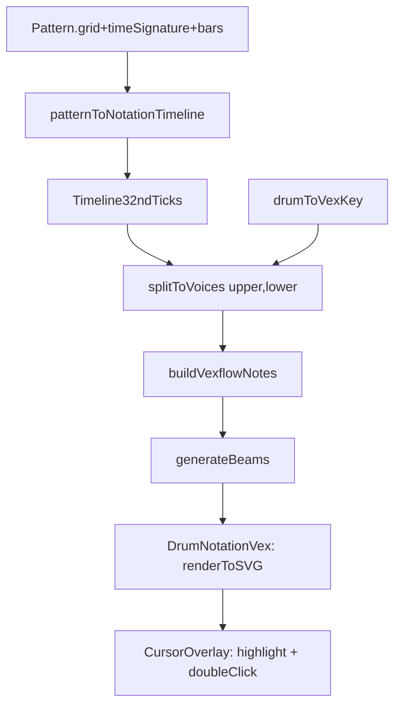

# MuseScore 风格鼓谱（Notation 区）改造计划（只读 + VexFlow）

## 目标与约束

- **目标**：把当前 `src/components/PatternEditor/DrumNotation.tsx` 从"每格一个自绘符号"升级为 **标准鼓谱渲染**（类似 MuseScore 的观感）：打击乐谱号(percussion clef)、小节线、符杆/符尾、16/32 分音符连线(beams)、同一时刻多鼓件和弦(chord)。
- **只读**：编辑仍在 Grid 完成；Notation 保留现有的 **双击定位（subdivision）** 行为。
- **对齐**：保持与 Grid **同一条横向时间轴**（同一滚动容器、播放游标按 subdivision 高亮）。

## 现状梳理（关键点）

- **当前使用 6 线谱**（非标准），需迁移到 VexFlow 的标准 5 线打击乐谱
- Notation 现在使用纯 SVG 线性时间轴：总宽度 = `totalSubdivisions * cellWidth`，并以 `subdivisionIndex` 线性映射到 x 坐标
- 节奏分辨率：`SUBDIVISIONS_PER_BEAT = 4`（每拍 4 格=16 分）
- 额外用 `CellState` 表达 **32 分拆分**（`CELL_DOUBLE_32`/`CELL_FIRST_32`/`CELL_SECOND_32`）
- 播放/高亮：当前 UI 的"currentBeat"实际是 **subdivision 索引**

## 方案选择

- **渲染引擎**：使用已安装的 `vexflow@5.0.0`，用其 SMuFL 字形与排版能力绘制标准音符
- **布局策略（核心：与 Grid 对齐）**：
  - **不走完全自动排版**（否则音符 x 位置会随时值变化，导致与 Grid 列不对齐）
  - 采用"**固定网格 x 坐标 + VexFlow 负责字形与连线**"的混合方式
  - 谱号区域独立放置，不影响音符起始 x 坐标

## 数据流与模块拆分



## 关键实现细节

### 0) VexFlow 可行性验证（vexflow-poc）

在正式开发前，先创建一个最小验证：

```typescript
// 验证目标：
// 1. 能否创建 percussion clef 的 Stave
// 2. 能否手动设置 StaveNote 的 x 坐标（绑定 Stave 后调用 setX）
// 3. 能否正确渲染 x notehead（镲片）和普通 notehead（鼓）
```

**验证方式**：创建 `src/components/PatternEditor/VexFlowPOC.tsx`，在一个独立页面测试。

**如果验证失败**（x 坐标无法控制）：
- 降级方案 A：只用 VexFlow 的 Glyph API 绘制符号，布局完全自己做
- 降级方案 B：继续使用纯 SVG，但改进符号设计（添加符杆/连线）

### 1) 鼓件到 VexFlow 映射（drum-to-vex）

新增映射文件：[`src/utils/drumToVex.ts`](src/utils/drumToVex.ts)

**从 6 线谱迁移到 5 线谱的映射**：

```typescript
import type { DrumType } from '../types';

// VexFlow percussion 标准位置映射
// key 格式: 'pitch/octave' 或 'pitch/octave/modifier'
// notehead: 'x' | 'x2' | 'd' | 'normal' 等
export interface VexDrumMapping {
  key: string;           // VexFlow key，如 'g/5/x2', 'c/5'
  notehead: 'x' | 'normal' | 'diamond';
  stemDirection: 1 | -1; // 1=向上, -1=向下
  voice: 'upper' | 'lower';
}

export const DRUM_TO_VEX: Record<DrumType, VexDrumMapping> = {
  // 上声部（符杆向上）- 镲片类
  'Crash 1':      { key: 'a/5',   notehead: 'x',      stemDirection: 1,  voice: 'upper' },
  'Crash 2':      { key: 'a/5',   notehead: 'x',      stemDirection: 1,  voice: 'upper' },
  'Hi-Hat Open':  { key: 'g/5',   notehead: 'diamond', stemDirection: 1, voice: 'upper' }, // 菱形=open
  'Hi-Hat Closed':{ key: 'g/5',   notehead: 'x',      stemDirection: 1,  voice: 'upper' },
  'Ride':         { key: 'f/5',   notehead: 'x',      stemDirection: 1,  voice: 'upper' },
  
  // 下声部（符杆向下）- 鼓类
  'Tom 1':        { key: 'e/5',   notehead: 'normal', stemDirection: -1, voice: 'lower' },
  'Tom 2':        { key: 'd/5',   notehead: 'normal', stemDirection: -1, voice: 'lower' },
  'Snare':        { key: 'c/5',   notehead: 'normal', stemDirection: -1, voice: 'lower' },
  'Tom 3':        { key: 'a/4',   notehead: 'normal', stemDirection: -1, voice: 'lower' },
  'Kick':         { key: 'f/4',   notehead: 'normal', stemDirection: -1, voice: 'lower' },
};

// Crash 特殊处理：叠加圆圈符号
export function isCrashWithCircle(drum: DrumType): boolean {
  return drum === 'Crash 1' || drum === 'Crash 2';
}
```

### 2) 32 分 tick 时间线（timeline-32nd）

新增转换器：[`src/utils/notation/patternToTimeline.ts`](src/utils/notation/patternToTimeline.ts)

```typescript
import type { Pattern, DrumType, CellState } from '../../types';
import { CELL_NORMAL, CELL_GHOST, CELL_GRACE, CELL_DOUBLE_32, CELL_FIRST_32, CELL_SECOND_32 } from '../../types';

// 每拍 8 个 32 分 tick（对应 4 个 16 分 subdivision）
export const TICKS_PER_BEAT = 8;
export const TICKS_PER_SUBDIVISION = 2; // 每个 16 分格子 = 2 个 32 分 tick

export interface NoteEvent {
  tick: number;           // 32 分 tick 索引（0-based，全曲）
  drum: DrumType;
  velocity: 'normal' | 'ghost' | 'grace';
  subdivision: number;    // 原始 16 分 subdivision 索引（用于 x 坐标计算）
  is32nd: boolean;        // 是否为 32 分音符（用于 beaming）
  tick32ndOffset: 0 | 1;  // 在 subdivision 内的偏移（0=前半, 1=后半）
}

export function patternToTimeline(pattern: Pattern): NoteEvent[] {
  const events: NoteEvent[] = [];
  
  pattern.grid.forEach((row, drumIndex) => {
    const drum = pattern.drums[drumIndex];
    
    row.forEach((cellState, subdivisionIndex) => {
      if (!cellState) return;
      
      const baseTick = subdivisionIndex * TICKS_PER_SUBDIVISION;
      const velocity = cellState === CELL_GHOST ? 'ghost' 
                     : cellState === CELL_GRACE ? 'grace' 
                     : 'normal';
      
      switch (cellState) {
        case CELL_NORMAL:
        case CELL_GHOST:
        case CELL_GRACE:
          // 16 分音符：落在偶数 tick
          events.push({
            tick: baseTick,
            drum,
            velocity,
            subdivision: subdivisionIndex,
            is32nd: false,
            tick32ndOffset: 0,
          });
          break;
          
        case CELL_DOUBLE_32:
          // 双 32 分：前后各一个
          events.push({
            tick: baseTick,
            drum,
            velocity: 'normal',
            subdivision: subdivisionIndex,
            is32nd: true,
            tick32ndOffset: 0,
          });
          events.push({
            tick: baseTick + 1,
            drum,
            velocity: 'normal',
            subdivision: subdivisionIndex,
            is32nd: true,
            tick32ndOffset: 1,
          });
          break;
          
        case CELL_FIRST_32:
          events.push({
            tick: baseTick,
            drum,
            velocity: 'normal',
            subdivision: subdivisionIndex,
            is32nd: true,
            tick32ndOffset: 0,
          });
          break;
          
        case CELL_SECOND_32:
          events.push({
            tick: baseTick + 1,
            drum,
            velocity: 'normal',
            subdivision: subdivisionIndex,
            is32nd: true,
            tick32ndOffset: 1,
          });
          break;
      }
    });
  });
  
  // 按 tick 排序
  return events.sort((a, b) => a.tick - b.tick);
}
```

### 3) 声部分配（voice-split）

新增分配器：[`src/utils/notation/splitToVoices.ts`](src/utils/notation/splitToVoices.ts)

```typescript
import type { NoteEvent } from './patternToTimeline';
import { DRUM_TO_VEX } from '../drumToVex';

export interface TickChord {
  tick: number;
  subdivision: number;
  tick32ndOffset: 0 | 1;
  is32nd: boolean;
  keys: string[];         // VexFlow keys 数组（同 tick 的多个鼓件）
  noteheads: string[];    // 对应的 notehead 类型
  velocity: 'normal' | 'ghost' | 'grace';
  drums: string[];        // 原始鼓件名（用于特殊处理如 Crash 圆圈）
}

export interface VoiceData {
  upper: TickChord[];  // 镲片类，符杆向上
  lower: TickChord[];  // 鼓类，符杆向下
}

export function splitToVoices(events: NoteEvent[]): VoiceData {
  // 按 tick 分组
  const tickMap = new Map<number, NoteEvent[]>();
  events.forEach(e => {
    const arr = tickMap.get(e.tick) || [];
    arr.push(e);
    tickMap.set(e.tick, arr);
  });
  
  const upper: TickChord[] = [];
  const lower: TickChord[] = [];
  
  tickMap.forEach((tickEvents, tick) => {
    const upperEvents = tickEvents.filter(e => DRUM_TO_VEX[e.drum].voice === 'upper');
    const lowerEvents = tickEvents.filter(e => DRUM_TO_VEX[e.drum].voice === 'lower');
    
    if (upperEvents.length > 0) {
      const first = upperEvents[0];
      upper.push({
        tick,
        subdivision: first.subdivision,
        tick32ndOffset: first.tick32ndOffset,
        is32nd: first.is32nd,
        keys: upperEvents.map(e => DRUM_TO_VEX[e.drum].key),
        noteheads: upperEvents.map(e => DRUM_TO_VEX[e.drum].notehead),
        velocity: first.velocity,
        drums: upperEvents.map(e => e.drum),
      });
    }
    
    if (lowerEvents.length > 0) {
      const first = lowerEvents[0];
      lower.push({
        tick,
        subdivision: first.subdivision,
        tick32ndOffset: first.tick32ndOffset,
        is32nd: first.is32nd,
        keys: lowerEvents.map(e => DRUM_TO_VEX[e.drum].key),
        noteheads: lowerEvents.map(e => DRUM_TO_VEX[e.drum].notehead),
        velocity: first.velocity,
        drums: lowerEvents.map(e => e.drum),
      });
    }
  });
  
  // 按 tick 排序
  upper.sort((a, b) => a.tick - b.tick);
  lower.sort((a, b) => a.tick - b.tick);
  
  return { upper, lower };
}
```

### 4) VexFlow 音符构建（vex-notes）

新增构建器：[`src/utils/notation/buildVexflowNotes.ts`](src/utils/notation/buildVexflowNotes.ts)

```typescript
import { StaveNote, Stave, Voice, Formatter } from 'vexflow';
import type { TickChord } from './splitToVoices';

export interface VexNoteWithPosition {
  note: StaveNote;
  subdivision: number;
  tick32ndOffset: 0 | 1;
  is32nd: boolean;
}

export function buildVexflowNotes(
  chords: TickChord[],
  stave: Stave,
  stemDirection: 1 | -1,
  cellWidth: number
): VexNoteWithPosition[] {
  return chords.map(chord => {
    const duration = chord.is32nd ? '32' : '16';
    
    const note = new StaveNote({
      clef: 'percussion',
      keys: chord.keys,
      duration,
      stem_direction: stemDirection,
    });
    
    // 设置 noteheads
    chord.noteheads.forEach((nh, i) => {
      if (nh === 'x') {
        note.setKeyStyle(i, { fillStyle: 'none' });
        // VexFlow 5.x: 使用 x notehead
        note.getKeyProps()[i].code = 'noteheadXBlack';
      } else if (nh === 'diamond') {
        note.getKeyProps()[i].code = 'noteheadDiamondBlack';
      }
    });
    
    // Ghost note: 添加括号
    if (chord.velocity === 'ghost') {
      // TODO: 添加括号修饰符
    }
    
    // 计算 x 坐标：与 Grid 对齐
    const baseX = chord.subdivision * cellWidth + cellWidth / 2;
    const xOffset = chord.tick32ndOffset === 0 ? -cellWidth * 0.22 : cellWidth * 0.22;
    const x = chord.is32nd ? baseX + xOffset : baseX;
    
    note.setStave(stave);
    // VexFlow 5.x: 手动设置 x 坐标（绑定 stave 后）
    note.setXShift(x - note.getX());
    
    return {
      note,
      subdivision: chord.subdivision,
      tick32ndOffset: chord.tick32ndOffset,
      is32nd: chord.is32nd,
    };
  });
}
```

### 5) Beaming 实现（vex-beams）

新增 beaming 逻辑：[`src/utils/notation/generateBeams.ts`](src/utils/notation/generateBeams.ts)

```typescript
import { Beam, StaveNote } from 'vexflow';
import type { VexNoteWithPosition } from './buildVexflowNotes';
import { SUBDIVISIONS_PER_BEAT } from '../constants';

// 按拍分组生成 beams
export function generateBeams(
  notes: VexNoteWithPosition[],
  beatsPerBar: number,
  totalBars: number
): Beam[] {
  const beams: Beam[] = [];
  const subdivisionsPerBeat = SUBDIVISIONS_PER_BEAT;
  const totalBeats = beatsPerBar * totalBars;
  
  for (let beat = 0; beat < totalBeats; beat++) {
    const beatStart = beat * subdivisionsPerBeat;
    const beatEnd = beatStart + subdivisionsPerBeat;
    
    // 获取这一拍内的所有音符
    const beatNotes = notes.filter(n => 
      n.subdivision >= beatStart && n.subdivision < beatEnd
    );
    
    if (beatNotes.length >= 2) {
      // 只对 16 分或 32 分音符做 beaming
      const staveNotes = beatNotes.map(n => n.note);
      try {
        const beam = new Beam(staveNotes);
        beams.push(beam);
      } catch {
        // 如果 beam 创建失败（如音符不连续），跳过
      }
    }
  }
  
  return beams;
}
```

### 6) DrumNotationVex 组件（整合）

新建组件：[`src/components/PatternEditor/DrumNotationVex.tsx`](src/components/PatternEditor/DrumNotationVex.tsx)

**布局策略：谱号区域独立，音符区域从 x=0 开始**

```typescript
import { useRef, useEffect } from 'react';
import { Renderer, Stave, Voice, Formatter, Beam } from 'vexflow';
import type { Pattern } from '../../types';
import { useGridCellSize } from '../../hooks/useGridCellSize';
import { SUBDIVISIONS_PER_BEAT } from '../../utils/constants';
import { patternToTimeline } from '../../utils/notation/patternToTimeline';
import { splitToVoices } from '../../utils/notation/splitToVoices';
import { buildVexflowNotes } from '../../utils/notation/buildVexflowNotes';
import { generateBeams } from '../../utils/notation/generateBeams';
import './DrumNotationVex.css';

interface DrumNotationVexProps {
  pattern: Pattern;
  currentBeat?: number;
  onDoubleClick?: (subdivision: number) => void;
}

const STAFF_HEIGHT = 80;
const CLEF_WIDTH = 50; // 谱号区域宽度

export function DrumNotationVex({
  pattern,
  currentBeat,
  onDoubleClick,
}: DrumNotationVexProps) {
  const containerRef = useRef<HTMLDivElement>(null);
  const cellWidth = useGridCellSize();
  
  const [beatsPerBar] = pattern.timeSignature;
  const totalSubdivisions = pattern.bars * beatsPerBar * SUBDIVISIONS_PER_BEAT;
  const notationWidth = totalSubdivisions * cellWidth;
  
  useEffect(() => {
    if (!containerRef.current) return;
    
    // 清空容器
    containerRef.current.innerHTML = '';
    
    // 创建 SVG renderer
    const renderer = new Renderer(containerRef.current, Renderer.Backends.SVG);
    renderer.resize(notationWidth, STAFF_HEIGHT);
    const context = renderer.getContext();
    
    // 创建 stave（percussion clef）
    const stave = new Stave(0, 0, notationWidth);
    stave.addClef('percussion');
    stave.setContext(context).draw();
    
    // 转换数据
    const timeline = patternToTimeline(pattern);
    const { upper, lower } = splitToVoices(timeline);
    
    // 构建音符
    const upperNotes = buildVexflowNotes(upper, stave, 1, cellWidth);
    const lowerNotes = buildVexflowNotes(lower, stave, -1, cellWidth);
    
    // 生成 beams
    const upperBeams = generateBeams(upperNotes, beatsPerBar, pattern.bars);
    const lowerBeams = generateBeams(lowerNotes, beatsPerBar, pattern.bars);
    
    // 绘制音符
    [...upperNotes, ...lowerNotes].forEach(n => n.note.setContext(context).draw());
    
    // 绘制 beams
    [...upperBeams, ...lowerBeams].forEach(b => b.setContext(context).draw());
    
  }, [pattern, cellWidth, notationWidth, beatsPerBar]);
  
  const handleDoubleClick = (event: React.MouseEvent) => {
    if (!onDoubleClick || !containerRef.current) return;
    const rect = containerRef.current.getBoundingClientRect();
    const x = event.clientX - rect.left;
    const subdivision = Math.floor(x / cellWidth);
    onDoubleClick(subdivision);
  };
  
  return (
    <div className="drum-notation-vex-wrapper">
      {/* 谱号区域（固定，不随滚动） */}
      <div className="drum-notation-clef" style={{ width: CLEF_WIDTH }}>
        {/* 可选：静态谱号 SVG */}
      </div>
      
      {/* 音符区域 */}
      <div 
        className="drum-notation-vex-container"
        ref={containerRef}
        onDoubleClick={handleDoubleClick}
        style={{ width: notationWidth }}
      >
        {/* VexFlow 渲染到这里 */}
        
        {/* 播放高亮 overlay */}
        {currentBeat !== undefined && currentBeat >= 0 && (
          <div
            className="notation-cursor-highlight"
            style={{
              left: currentBeat * cellWidth,
              width: cellWidth,
            }}
          />
        )}
      </div>
    </div>
  );
}
```

### 7) CSS 样式

新建样式：[`src/components/PatternEditor/DrumNotationVex.css`](src/components/PatternEditor/DrumNotationVex.css)

```css
.drum-notation-vex-wrapper {
  display: flex;
  position: relative;
}

.drum-notation-clef {
  flex-shrink: 0;
  /* 谱号可以用 position: sticky 固定在左侧 */
}

.drum-notation-vex-container {
  position: relative;
}

.notation-cursor-highlight {
  position: absolute;
  top: 0;
  bottom: 0;
  background: var(--color-warning);
  opacity: 0.4;
  pointer-events: none;
}
```

### 8) 替换入口（wire-up）

在 [`src/components/PatternEditor/PatternEditor.tsx`](src/components/PatternEditor/PatternEditor.tsx) 中：

```typescript
// 替换导入
import { DrumNotationVex } from './DrumNotationVex';
// 保留旧实现用于回滚
// import { DrumNotation } from './DrumNotation';

// 在 JSX 中替换
<DrumNotationVex
  pattern={pattern}
  currentBeat={currentBeat}
  onDoubleClick={onNotationDoubleClick}
/>
```

**回滚策略**：将 `DrumNotation.tsx` 重命名为 `DrumNotationLegacy.tsx`，保留以便快速回退。

## 文件结构

```
src/
├── utils/
│   ├── drumToVex.ts              # 鼓件→VexFlow 映射
│   └── notation/
│       ├── patternToTimeline.ts  # Grid→32分tick时间线
│       ├── splitToVoices.ts      # 声部分配
│       ├── buildVexflowNotes.ts  # 构建 VexFlow 音符
│       └── generateBeams.ts      # 生成 beams
└── components/
    └── PatternEditor/
        ├── DrumNotationVex.tsx   # 新组件
        ├── DrumNotationVex.css
        ├── DrumNotationLegacy.tsx # 旧组件（重命名保留）
        └── VexFlowPOC.tsx        # 可行性验证（临时）
```

## 验收标准

### MVP（全功能目标）

- [x] VexFlow 可行性验证通过
- [ ] Notation 区显示 percussion clef、标准五线谱
- [ ] 16 分音符正确显示符杆与 notehead（x/普通/菱形）
- [ ] 32 分音符正确显示（同格内左右错开）
- [ ] 同 tick 多鼓件以和弦形式叠加
- [ ] Beams 按拍分组连接
- [ ] 与 Grid 横向滚动完全一致
- [ ] 播放高亮列同步
- [ ] Ghost note 显示括号
- [ ] 双击定位功能正常

### 后续增强（Phase 2）

- Hi-Hat Open 的专门 articulation 符号（而非菱形）
- Crash 的圆圈叠加效果
- 真正的 Grace Note（VexFlow GraceNoteGroup）
- Rest 的可选显示
- 更精细的 beaming 规则（跨 subdivision 连接）

## 风险与降级

| 风险 | 可能性 | 降级方案 |
|------|--------|----------|
| VexFlow x 坐标控制失败 | 中 | 只用 Glyph API，自己做 SVG 布局 |
| Beaming 与固定 x 冲突 | 中 | 简化为单音符独立符杆，无 beam |
| 性能问题（大量音符） | 低 | 按需渲染可见小节（虚拟滚动） |

## 开发顺序

1. **vexflow-poc**（0.5天）：验证核心技术
2. **drum-to-vex + timeline-32nd**（并行，0.5天）
3. **voice-split**（0.5天）
4. **vex-notes**（1天）：核心渲染
5. **vex-beams + cursor-overlay**（并行，0.5天）
6. **wire-up + 测试**（0.5天）

**预计总工时**：3-4 天
